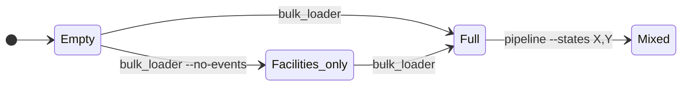
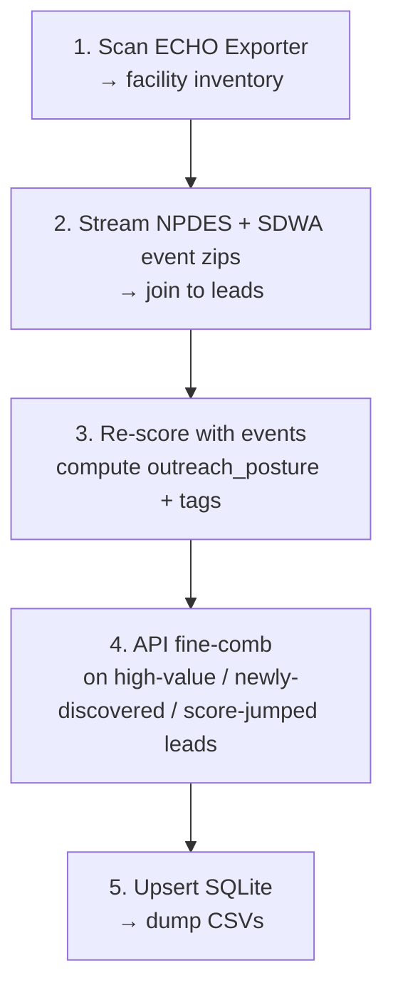

# Data state map

How the two entry points (`bulk_loader` and `pipeline`) populate the
SQLite source of truth, and how to move between depths of detail.

---

## States you can land in



| State            | Coverage   | Per-event detail                  | SDWA breadth         |
|---               |---         |---                                |---                   |
| Facilities only  | nationwide | _none_                            | SNC + formal (tight) |
| Full             | nationwide | full DMR on top leads, codes only on the rest | SNC + formal (tight) |
| Mixed            | both       | full DMR everywhere in chosen states | broader in those states (`p_viola=Y`) |

Every transition writes through `snapshot.sqlite`; the DB never
deletes rows, so paths layer additively.

---

## What `bulk_loader` does internally — one command, five stages



`bulk_loader` (no flags) runs **all five stages in one process**, ~15-30 min
total. You don't need to issue each stage separately. `--no-events` stops
after stage 1.

---

## What's in `out/` after each command

Every run writes into its **own subfolder** so runs never overwrite each
other. The folder is named `<command>_<scope>_<YYYYMMDD-HHMMSS>`, where
`scope` is the joined state list (or `nationwide` when there's no state
filter):

```
out/
├── bulk_nationwide_20260527-090000/      ← a nationwide bulk run
│   ├── READ_ME_FIRST.txt          ← lag warning, always
│   ├── all_leads.csv              ← every lead this run touched, ranked
│   ├── violation_events.csv       ← every event tied to those leads
│   ├── run_health.json            ← run metadata + warnings + signals
│   ├── new_facilities_YYYYMMDD.csv    ← facilities first seen in THIS run
│   ├── newly_snc_YYYYMMDD.csv         ← facilities that just crossed SNC
│   └── new_violations_YYYYMMDD.csv    ← events first seen in THIS run
└── pipeline_WA-AL-VA-LA-GA_20260527-121500/   ← a later targeted run
    ├── all_leads.csv              ← those 5 states, with full DMR depth
    └── … (same file set)
```

The folder is self-contained — nothing is written to `out/` root. A
targeted `pipeline` run therefore can't clobber an earlier nationwide
`bulk` run; both folders sit side by side. The DB
(`snapshot.sqlite`) remains the cross-run source of truth; these
folders are just per-run CSV snapshots dumped from it. The path is
echoed at the end of each run.

**Upload to the viewer**: from the run folder you want to look at, pick
`all_leads.csv`, `violation_events.csv`, and `run_health.json` together.
The first two populate the Inventory tab; the JSON populates the Run
Health tab with coverage gaps, depth gaps, run warnings, and suggested
follow-up commands. (The viewer shows one run at a time — to compare a
nationwide run with a targeted run, upload one, then the other.)

On a first run from an empty DB, the three `new_*` files are
essentially copies of `all_leads.csv` / `violation_events.csv` (no
baseline to diff against). On a later run, they hold only the
genuinely fresh rows since the previous run.

---

## Cost of each path

|                           | Time             | EPA load                              |
|---                        |---               |---                                    |
| `bulk_loader --no-events` | 5–10 min         | 1 download (~250 MB), zero API calls  |
| `bulk_loader`             | 15–30 min        | 3 downloads (~830 MB) + auto fine-comb |
| `pipeline --states X`     | 5–20 min × state | hundreds of API calls per state       |

After 7 days, `bulk_loader` re-downloads (cache invalidates to match
EPA's weekly refresh). Inside that window, runs are ~3-10 min because
the zips are cached.

---

## "Which state am I in?"

```bash
sqlite3 snapshot.sqlite "
  SELECT program, outreach_posture, COUNT(*)
  FROM facilities GROUP BY 1, 2 ORDER BY 1, 2"
```

- All `no_events` → **Facilities only**
- Mix of `active` / `enforcement_underway` / `verify_first` → **Full**
- One or two states with mostly `active` / rich SDWA detail → **Mixed**
