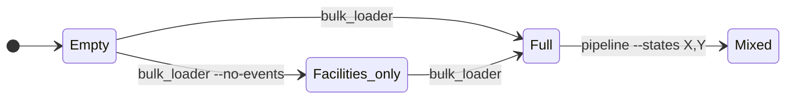
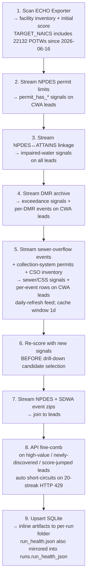

# Data state map

How the two entry points (`bulk_loader` and `pipeline`) populate the
SQLite source of truth, and how to move between depths of detail.

---

## States you can land in



| State            | Coverage   | Per-event detail                  | SDWA breadth         |
|---               |---         |---                                |---                   |
| Facilities only  | nationwide | _none_                            | SNC + formal (tight) |
| Full             | nationwide | full DMR on top leads, codes only on the rest | SNC + formal (tight) |
| Mixed            | both       | full DMR everywhere in chosen states | broader in those states (`p_viola=Y`) |

Every transition writes through `snapshot.sqlite`; the DB never
deletes rows, so paths layer additively.

---

## What `bulk_loader` does internally — one command, nine stages



`bulk_loader` (no flags) runs **all nine stages in one process**, ~10-30 min
total (warm cache). You don't need to issue each stage separately. `--no-events`
stops after stage 1 — every download and signal-stream stage past it is gated
on `include_events` and pinned by `tests/test_no_events_flag.py`.

---

## What's in `out/` after each command

Every run writes into its **own subfolder** so runs never overwrite each
other. The folder is named `<command>_<scope>_<YYYYMMDD-HHMMSS>`, where
`scope` is the joined state list (or `nationwide` when there's no state
filter). Each folder is tiny (~100 KB) — only the artifacts that can't
be reconstructed from `snapshot.sqlite` land inline:

```
out/
├── bulk_nationwide_20260527-090000/      ← a nationwide bulk run
│   ├── run_health.json                 ← run metadata + warnings + signals
│   └── newly_snc_YYYYMMDD.csv          ← facilities that just crossed SNC
│                                          (skipped when the diff is empty)
└── pipeline_WA-AL-VA-LA-GA_20260527-121500/   ← a later targeted run
    └── … (same file set)
```

The big CSVs (`all_leads.csv`, `violation_events.csv`,
`new_facilities.csv`, `new_violations.csv`) are pure views of the DB
and are materialized on demand:

```
materialized/run_42/
├── all_leads.csv              ← every lead the run touched, ranked
├── violation_events.csv       ← every event tied to those leads
├── new_facilities.csv         ← facilities first seen in THIS run
└── new_violations.csv         ← events first seen in THIS run
```

via:

```bash
python -m chemtreat_water_leads.dump_run --db ./snapshot.sqlite \
    --latest --out ./materialized/run_latest
```

The end-of-run log prints the exact command for the run that just
finished. The folder is self-contained — nothing is written to `out/`
root. A targeted `pipeline` run therefore can't clobber an earlier
nationwide `bulk` run; both folders sit side by side. The DB
(`snapshot.sqlite`) remains the cross-run source of truth; the inline
files capture the moment-in-time state nobody else can rebuild, and
the materialized files are pure DB views on demand.

**Upload to the viewer**: materialize the run you want, then pick
`all_leads.csv`, `violation_events.csv`, AND `run_health.json` all
from the materialized folder. The first two populate the Inventory
tab; the JSON populates the Run Health tab with coverage gaps, depth
gaps, run warnings, and suggested follow-up commands. (`dump_run`
mirrors `run_health.json` out of `runs.run_health_json` since
2026-06-16; for legacy runs that pre-date that schema change, the
JSON still has to come from `out/<run-folder>/` and `dump_run`'s CLI
tells you so when it skips.) The viewer shows one run at a time — to
compare a nationwide run with a targeted run, materialize each
separately and upload one, then the other.

On a first run from an empty DB, `new_facilities.csv` is essentially a
copy of `all_leads.csv` (everything is new). On a later run, it holds
only the genuinely fresh rows since the previous run.

---

## Cost of each path

|                           | Time             | EPA load                                            |
|---                        |---               |---                                                  |
| `bulk_loader --no-events` | 5–10 min         | 1 download (~423 MB), zero API calls                |
| `bulk_loader`             | 10–30 min        | 6 downloads (~2.2 GB compressed) + auto fine-comb   |
| `pipeline --states X`     | 5–20 min × state | hundreds of API calls per state                     |

After 7 days, `bulk_loader` re-downloads (cache invalidates to match
EPA's weekly refresh). Inside that window, runs are ~5-15 min because
the zips are cached — the DMR archive stream-filter (~30 min on first
encounter against a 5 GB CSV) is the dominant cost when only a small
permit set matches.

**Fine-comb 429 handling.** EPA's effluent_chart / DFR endpoints
sometimes throttle our IP with persistent HTTP 429s. `_drill_cwa` /
`_drill_sdwa` track consecutive 429s and bail out at
`THROTTLE_STREAK_THRESHOLD = 20` to avoid grinding for hours at
1–2 s/call. Bailed candidates are marked `lookup_failed` in
`run_health.json` and surface in the viewer's Run Health card with
a copy-paste re-run command.

---

## "Which state am I in?"

```bash
sqlite3 snapshot.sqlite "
  SELECT program, outreach_posture, COUNT(*)
  FROM facilities GROUP BY 1, 2 ORDER BY 1, 2"
```

- All `no_events` → **Facilities only**
- Mix of `active` / `enforcement_underway` / `verify_first` → **Full**
- One or two states with mostly `active` / rich SDWA detail → **Mixed**
